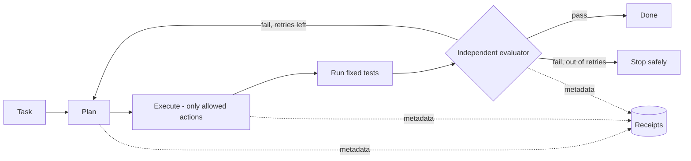

# Coral Forge

**How to let an AI coding agent change code without just taking its word that it worked.**

`Status: teaching demo of a pattern from my private agent experiments · the "agent" is scripted · Python · 6 tests`

---

## The idea

When an AI coding agent says "Done! All tests pass," that's a claim, not evidence. I spent time running local coding agents in sandboxes, and the lesson that stuck was the same one I learned in manufacturing QC: **the person (or model) who did the work shouldn't be the one who signs off on it.**

Coral Forge is a small demo of that loop:



## See it work

The task: apply a 20% seasonal discount. The first attempt gets it wrong on purpose (10%), and the demo shows the system catching it:

```text
Attempt 1: wrote discounts.py.
Attempt 1: tests failed; retry permitted (1 of 2).
Attempt 2: wrote discounts.py.
Attempt 2: tests passed; evaluation passed.
Receipt created: run=demo-..., events=12.
```

## The controls

| Control | Why |
|---|---|
| **Plan and execution are separate** | You can inspect what the agent intends before anything changes. |
| **Allow-list of actions** | It can write one specific file and run one fixed test command. Anything else is refused. |
| **Tests decide, not the agent** | The evaluator reads the test result. The agent's own opinion of its work isn't an input. |
| **Hard retry limit** | Two attempts, then it stops. No infinite loops burning time and money. |
| **Receipts without contents** | Every step is logged with hashes and summaries, but not the code or test output itself. |

## Being honest about what this is

The planner here is **scripted**: it returns a known wrong answer, then a known right one, so the demo is reproducible. There is no live model in this repo. The point is the loop around the agent, not the agent.

The temporary workspace is **not a security sandbox**. One of my private experiments ran the agent in Docker with no network, no host mounts, and dropped privileges, and even that is something I'd want a security professional to review before trusting it with untrusted code. See [docs/security-boundaries.md](docs/security-boundaries.md).

## Run it

Python 3.11+, no dependencies.

```bash
python -m pip install -e .
coral-forge-demo
python -m unittest discover -s tests -v
```

---

Built by [Michael Perry](https://perry.is). [More of my work →](https://github.com/perry-is)
