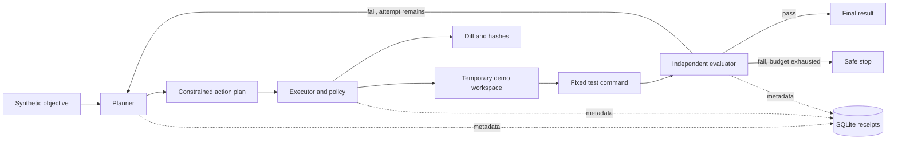

# Coral Forge

Coral Forge is a clean-room, local-first prototype for agentic software engineering workflows. It demonstrates how a coding agent can turn a small task into constrained file changes, run a fixed test suite, evaluate observable results, retry within a strict budget, and leave a durable receipt for review.

The portfolio edition is intentionally deterministic: it needs no live language model, network access, Docker, credentials, or private repository. Its synthetic pricing task makes the workflow easy to inspect and reproduce.

## Why this matters

AI-assisted coding is useful only when its actions can be bounded and its results can be checked. Coral Forge makes those controls visible: plans are separate from execution, execution accepts a small action set, tests provide evidence, retries have a hard limit, and receipts record what happened without storing source contents.

## What it demonstrates

- **Planning:** a structured plan is built from a synthetic objective and workspace inventory.
- **Constrained actions:** the executor permits one workspace-relative file write and one fixed test command.
- **Isolated demo workspace:** the scenario runs in a temporary directory and cannot edit this repository.
- **Diffs:** before-and-after file hashes and a unified diff show the effect of each write.
- **Evaluation:** a separate evaluator judges the fixed test result, not an agent's claim.
- **Bounded recovery:** a scripted first attempt fails; one correction is allowed. The workflow stops after two attempts.
- **Durable receipts:** SQLite stores append-only event metadata, result summaries, and hashes. It does not store source or test contents.
- **Synthetic tests:** all test inputs and expected results are invented for this demonstration.

## Architecture



See [docs/source-review.md](docs/source-review.md) for the clean-room source assessment and [docs/security-boundaries.md](docs/security-boundaries.md) for the threat boundary and limitations.

## Run it

Requires Python 3.11 or newer. From the repository root:

```bash
python -m venv .venv
# Windows: .venv\Scripts\activate
# macOS/Linux: source .venv/bin/activate
python -m pip install -e .
coral-forge-demo
```

The demo writes its local SQLite receipt database to `.local/forge.sqlite3`, which is ignored by Git. To choose another location:

```bash
coral-forge-demo --db-path .local/review.sqlite3
```

Run the tests with:

```bash
python -m unittest discover -s tests -v
```

## Example output

```text
Disclosure: allow (synthetic task only).
Route: local deterministic planner.
Attempt 1: tests failed; retry permitted (1 of 2).
Attempt 2: tests passed; evaluation passed.
Receipt created: run=demo-..., events=12.
```

The demo displays the disclosure decision, selected route, a synthetic diff, and receipt creation without showing context text in the decision/route output. SQLite stores receipt metadata and hashes, not file contents or test output.

## Technologies and workflow

The package uses Python 3.11+, the standard library, `subprocess` with an argument list and timeout, `tempfile`, `difflib`, and SQLite. There are no runtime third-party dependencies.

Each run follows this path:

1. Assemble a minimal task context from a built-in synthetic objective and a small workspace manifest.
2. Apply a disclosure decision. The demo allows only the synthetic task; there is no external model route.
3. Produce a typed, deterministic plan.
4. Check each action against a narrow policy before executing it in a temporary workspace.
5. Run the fixed unit-test command and evaluate the observable result independently.
6. Permit at most one correction, record event metadata in SQLite, and stop with a result.

## What I built

I designed this public-facing demonstration as a small, reviewable implementation of the workflow boundaries: plan/execute/evaluate separation, typed action contracts, workspace and command constraints, deterministic retry behavior, diff generation, independent test evaluation, and durable metadata-only receipts. The task, data, and tests are synthetic. The published edition is a clean-room implementation and does not contain production source code.

## Security considerations

The demo has no network/model calls and accepts no arbitrary repository or user-supplied commands. It uses an allowlisted filename, a fixed test invocation, a subprocess timeout, and a temporary workspace. These are useful workflow controls, not a hardened operating-system sandbox: a temporary directory does not prevent hostile code from accessing the host if arbitrary code is introduced. Do not adapt this demo to execute untrusted model output without a separately designed and reviewed isolation boundary.

Receipts contain event type, attempt number, outcomes, relative paths, hashes, and bounded summaries. They exclude file contents, prompts, credentials, and personal data. The local receipt database is runtime output and is ignored by Git.

## Scope

This repository demonstrates one deterministic software-change workflow. It does not include a live LLM, provider integrations, Docker sandboxing, repository-wide coding, production deployment, or claims of production readiness. Those capabilities are deliberately outside this portfolio edition.
